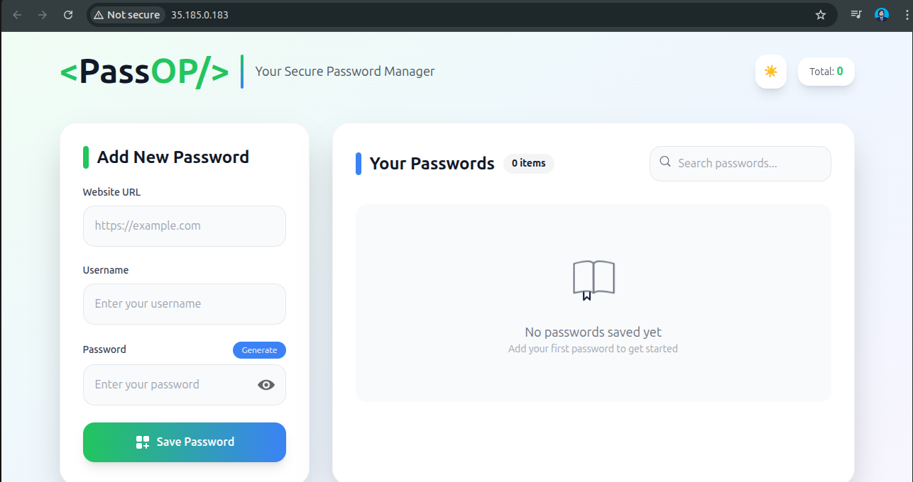

# 🔑 PASSOP: Your Secure Password Manager 🚀

PASSOP is a modern, full-stack password management application designed to securely store and manage your passwords. It provides a user-friendly interface to create, retrieve, and delete password entries, ensuring your sensitive information is protected. This project aims to simplify password management while prioritizing security and ease of use.

## 🚀 Key Features

- **Secure Password Storage:** Utilizes MongoDB to store password data securely.
- **User-Friendly Interface:** A clean and intuitive React frontend for easy password management.
- **API Driven:** A robust Node.js/Express backend provides API endpoints for all password operations.
- **Copy to Clipboard:** Easily copy passwords to your clipboard with a single click.
- **Password Visibility Toggle:** Toggle password visibility for easy verification.
- **Dockerized Deployment:** Easily deployable using Docker and Docker Compose.
- **Kubernetes Support:** Kubernetes configuration files included for scalable deployments.
- **CI/CD Pipeline:** Automated build, test, and deployment using GitHub Actions.
- **Notification System:** Provides feedback to the user using toast notifications.

## 🛠️ Tech Stack

- **Frontend:**
    - React
    - Vite
    - Tailwind CSS
    - React Toastify
    - UUID
- **Backend:**
    - Node.js
    - Express
    - MongoDB
    - Body-parser
    - Cors
    - Dotenv
- **Database:**
    - MongoDB
- **Containerization:**
    - Docker
    - Docker Compose
- **Orchestration:**
    - Kubernetes
- **CI/CD:**
    - GitHub Actions
- **Other:**
    - .env (for environment variables)

## 📦 Getting Started

Follow these instructions to get the project up and running on your local machine.

### Prerequisites

- Node.js (v18 or higher)
- npm (or yarn/pnpm)
- Docker (optional, for containerized deployment)
- Docker Compose (optional, for containerized deployment)
- Kubernetes (optional, for Kubernetes deployment)
- Google Cloud SDK (optional, for GCP deployment)

### Installation

1.  **Clone the repository:**

    ```bash
    git clone <repository_url>
    cd <repository_directory>
    ```

## 💻 Usage

Once the application is running, you can access the frontend in your browser. Use the provided form to add new password entries, and the displayed list to view, copy, and manage your existing passwords.

## 📂 Project Structure

```
├── .github/workflows/passop.yaml       # GitHub Actions CI/CD pipeline
├── backend/                            # Backend application
│   ├── .env                            # Environment variables
│   ├── server.js                       # Main server file
│   ├── package.json                    # Backend dependencies and scripts
│   ├── Dockerfile                      # Dockerfile for backend
│   └── ...
├── frontend/                           # Frontend application
│   ├── .env                            # Environment variables
│   ├── vite.config.js                  # Vite configuration
│   ├── package.json                    # Frontend dependencies and scripts
│   ├── Dockerfile                      # Dockerfile for frontend
│   ├── src/                            # Source code
│   │   ├── main.jsx                    # Entry point
│   │   ├── App.jsx                     # Main App component
│   │   ├── components/                 # Reusable components
│   │   │   ├── Manager.jsx             # Password Manager component
│   │   │   └── ...
│   │   └── ...
│   └── ...
├── k8s/                                # Kubernetes configuration files
│   ├── backend-config.yml             # Backend ConfigMap
│   ├── ingress.yml                     # Ingress resource
│   └── ...
├── docker-compose.yml                  # Docker Compose configuration
└── README.md                           # This file
```


## Installation Methods

###  **Clone the repository:**

```bash
    git clone https://github.com/umair6756/PASSOP.git
    cd PASSOP
```


### 1️⃣ Local Installation (Node.js + MongoDB)

You can run PASSOP locally using Node.js for backend and React for frontend, with MongoDB as the database.

#### **Backend Setup**

1. Navigate to the backend folder:
```bash
cd backend
```

2. Install dependencies:
```bash
npm install
```

3. Create a `.env` file inside the `backend` folder with the following content:
```env
MONGO_URI=mongodb://localhost:27017
DB_NAME=passop
```

> **Explanation:**  
> - `MONGO_URI` is the MongoDB connection string pointing to your local MongoDB instance.  
> - `DB_NAME` is the name of the database to use for PASSOP.


#### **Frontend Setup**

1. Navigate to the frontend folder:
```bash
cd ../frontend
```

2. Install dependencies:
```bash
npm install
```

3. Create a `.env` file inside the `frontend` folder:
```env
REACT_APP_API_URL=http://localhost:3000
```

> **Explanation:**  
> - `REACT_APP_API_URL` points to your backend API. The frontend will use this to make HTTP requests.


### **Running Services Locally**

1. **Start MongoDB** (either local installation or Docker):
```bash
docker run -d -p 27017:27017 --name passop-mongo mongo
```

2. **Start Backend**:
```bash
cd backend
npm start
```

3. **Start Frontend**:
```bash
cd ../frontend
npm run dev
```

Frontend will be accessible at: [http://localhost:5173](http://localhost:5173)


### 2️⃣ Docker Deployment

PASSOP can be containerized with Docker for easier deployment.

#### **Build Docker Images**

- **Backend**
```bash
docker build -t passop-backend ./backend
```

- **Frontend**
```bash
docker build -t passop-frontend ./frontend
```

#### **Run Docker Containers**

- **Backend**
```bash
docker run -d -p 3000:3000 --name passop-backend --env-file ./backend/.env passop-backend
```

- **Frontend**
```bash
docker run -d -p 5173:80 --name passop-frontend --env-file ./frontend/.env passop-frontend
```

> **Explanation:**  
> - `-d` runs containers in detached mode.  
> - `--env-file` loads environment variables from `.env`.  
> - Ports `3000` (backend) and `5173` (frontend) are exposed to host machine.


### 3️⃣ Docker Compose Deployment

A simpler way to run all services together is using Docker Compose.

1. Ensure `docker-compose.yml` is present in the root folder.
2. Run all services:
```bash
docker-compose up -d
```

This will spin up:
- MongoDB
- Backend API
- Frontend UI

3. **Stop services**
```bash
docker-compose down
```

> **Note:** Docker Compose automatically handles networking between containers, so backend and frontend can communicate using service names.

## 4️⃣ Kubernetes Deployment (GKE / Minikube / Local)

PASSOP can also be deployed on Kubernetes for production-grade scaling.

#### **Apply Kubernetes Manifests**

```bash
kubectl apply -f k8s/backend-deployment.yml
kubectl apply -f k8s/frontend-deployment.yml
kubectl apply -f k8s/backend-config.yml
kubectl apply -f k8s/ingress.yml
```

#### **Accessing Services**

- **Backend:** Accessible via ClusterIP or service name, e.g., `http://backend-service:5000`.
- **Frontend:** Exposed via Ingress or LoadBalancer.

> **Environment Variables:**  
> In Kubernetes, `.env` variables are configured via:
> - **ConfigMaps** (for non-sensitive data)
> - **Secrets** (for sensitive data like passwords or API keys)


## 📸 Screenshots

### Light Preview of Application 





### Dark Preview of Application 


## 🤝 Contributing

Contributions are welcome! Please follow these steps:

1.  Fork the repository.
2.  Create a new branch for your feature or bug fix.
3.  Make your changes and commit them with descriptive messages.
4.  Submit a pull request.

## 📝 License

This project is licensed under the [MIT License](LICENSE).

## 📬 Contact

For questions or issues, please contact: chumair6756@gmail.com

**Author:** Hafiz Umair

## 💖 Thanks

Thank you for checking out PASSOP! We hope it helps you manage your passwords securely and efficiently.


